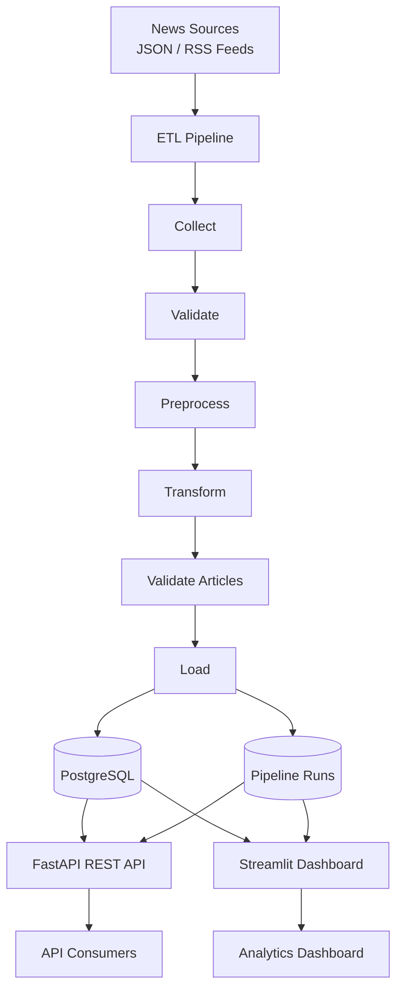
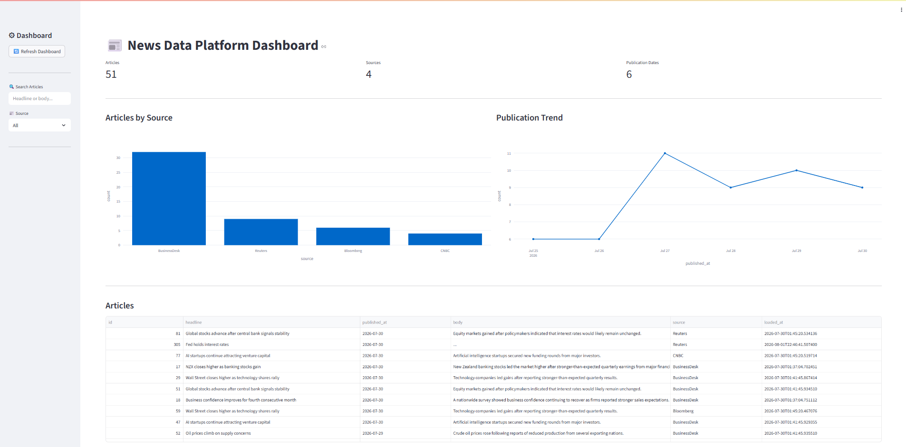
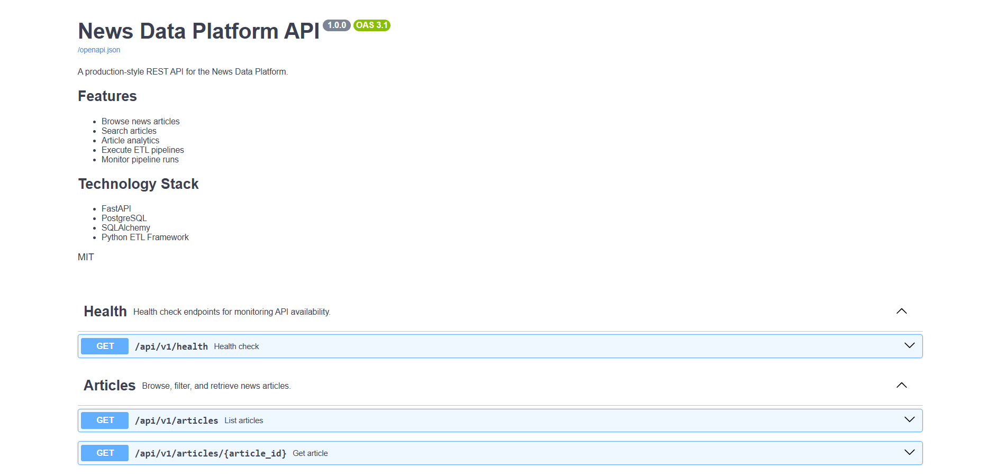
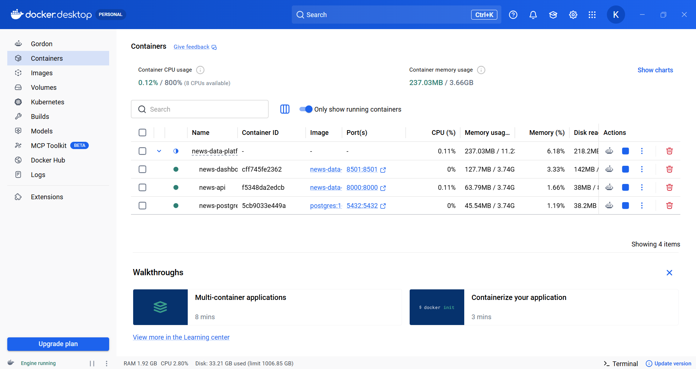
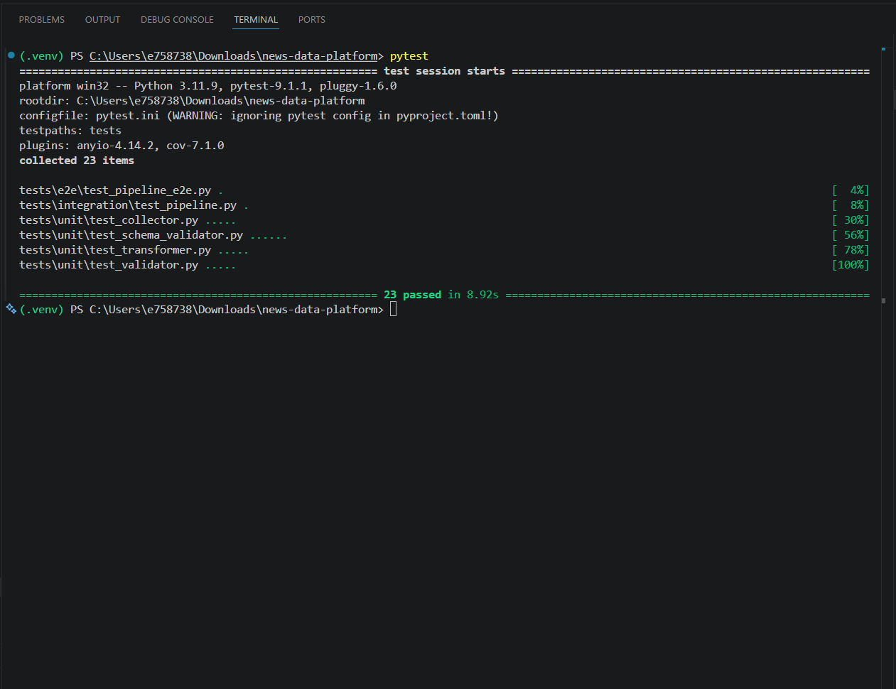
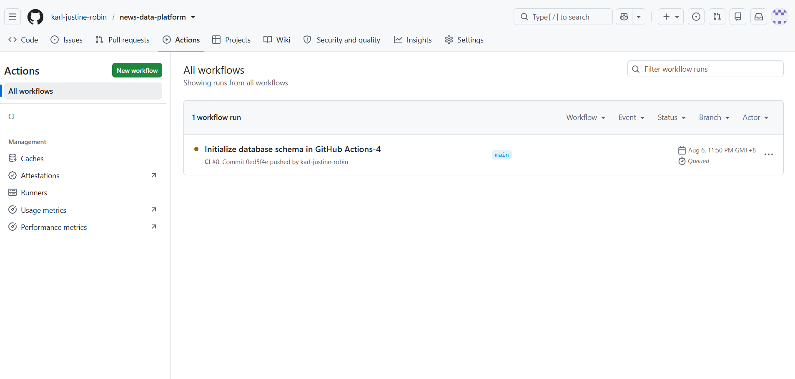

# 📰 News Data Platform

A production-style **Data Engineering portfolio project** that demonstrates an end-to-end ETL pipeline, REST API, analytics dashboard, testing, Docker, and CI/CD.

> **Status:** 🚧 Active Development

---

# Project Overview

The News Data Platform is a modern Data Engineering project designed to simulate a real-world news ingestion and analytics platform.

The system collects articles from multiple news sources, validates and transforms the data through a custom ETL pipeline, stores curated data in PostgreSQL, exposes the data through a FastAPI REST API, and visualizes insights using a Streamlit dashboard.

The project follows software engineering and data engineering best practices, including:

- Modular architecture
- Repository Pattern
- ETL pipeline design
- Automated testing
- Dockerized services
- Continuous Integration (GitHub Actions)
- Structured logging
- Pipeline monitoring
- REST API development

---

# Features

- Multi-source news ingestion
- ETL pipeline
- Data validation
- PostgreSQL storage
- FastAPI REST API
- Search API
- Analytics endpoints
- Streamlit dashboard
- Pipeline monitoring
- Structured logging
- Automated testing
- Docker support
- GitHub Actions CI/CD

---

# Tech Stack

| Category | Technology |
|-----------|------------|
| Language | Python 3.11 |
| Backend | FastAPI |
| Database | PostgreSQL |
| ORM | SQLAlchemy |
| Dashboard | Streamlit |
| Data Analysis | Pandas |
| Visualization | Plotly |
| Testing | Pytest |
| Containers | Docker, Docker Compose |
| CI/CD | GitHub Actions |
| Logging | Python Logging |
| Configuration | python-dotenv |

---

# Architecture



---

# Project Structure

```text
news-data-platform/
│
├── api/                    # FastAPI application
│   ├── app/
│   │   ├── routers/        # API endpoints
│   │   ├── schemas.py      # Pydantic schemas
│   │   ├── models.py       # SQLAlchemy model exports
│   │   ├── crud.py         # Database operations
│   │   ├── database.py     # Database connection
│   │   ├── middleware.py   # Custom middleware
│   │   ├── exceptions.py   # Global exception handlers
│   │   ├── logger.py       # API logging
│   │   ├── constants.py    # API constants
│   │   └── main.py         # FastAPI application
│   │
│   └── create_tables.py    # Database initialization
│
├── dashboard/              # Streamlit dashboard
│   └── app.py
│
├── data/                   # Sample datasets
│
├── docs/                   # Documentation
│
├── logs/                   # Pipeline log files
│
├── src/
│   ├── database/           # Database models & engine
│   ├── framework/
│   │   ├── collector/
│   │   ├── loader/
│   │   ├── logging/
│   │   ├── pipeline/
│   │   ├── preprocessor/
│   │   ├── repository/
│   │   ├── schema_validator/
│   │   ├── tracker/
│   │   ├── transformer/
│   │   └── validator/
│   │
│   └── vendors/            # Vendor-specific configurations
│
├── tests/
│   ├── unit/
│   ├── integration/
│   └── e2e/
│
├── .github/
│   └── workflows/          # GitHub Actions
│
├── docker-compose.yml
├── config.py
├── requirements.txt
├── pytest.ini
└── README.md
```

---

# Directory Overview

| Directory | Purpose |
|-----------|---------|
| **api/** | FastAPI REST API and database access layer |
| **dashboard/** | Interactive Streamlit analytics dashboard |
| **data/** | Sample datasets used by the ETL pipeline |
| **docs/** | Project documentation |
| **logs/** | Pipeline execution logs |
| **src/** | Core ETL framework and business logic |
| **tests/** | Unit, integration, and end-to-end tests |
| **.github/** | GitHub Actions CI workflow |

---

# Current Progress

## Completed

- ETL Pipeline
- PostgreSQL Integration
- Repository Pattern
- FastAPI REST API
- Search API
- Analytics API
- Streamlit Dashboard
- Pipeline Monitoring
- Structured Logging
- Docker Support
- Unit Tests
- Integration Tests
- End-to-End Tests
- GitHub Actions CI *(currently being finalized)*

---

# Roadmap

## Phase 1 — Data Engineering Foundations
- Project setup
- ETL framework
- Multi-source ingestion
- PostgreSQL
- FastAPI
- Streamlit
- Docker
- Testing

## Phase 2 — Advanced Data Engineering
- Data Quality Framework
- Bronze / Silver / Gold Architecture
- Incremental ETL
- Star Schema
- Advanced Analytics

## Phase 3 — Machine Learning
- NLP
- Article Categorization
- Trending Prediction
- Duplicate Detection
- ML Pipeline

## Phase 4 — Enterprise Data Platform
- Apache Airflow
- PySpark
- Azure Deployment
- Prometheus
- Grafana
- MLflow
- Databricks
- Delta Lake

---

# Future Improvements

- Apache Airflow orchestration
- PySpark distributed processing
- ML-powered article classification
- Azure deployment
- Kafka streaming pipeline
- Databricks Lakehouse
- MLflow model tracking
- Prometheus & Grafana monitoring
- Snowflake integration
- dbt transformations

---

# License

This project is licensed under the MIT License.


# Screenshots

## Dashboard



## FastAPI Documentation



## Docker



## Tests



## GitHub Actions

